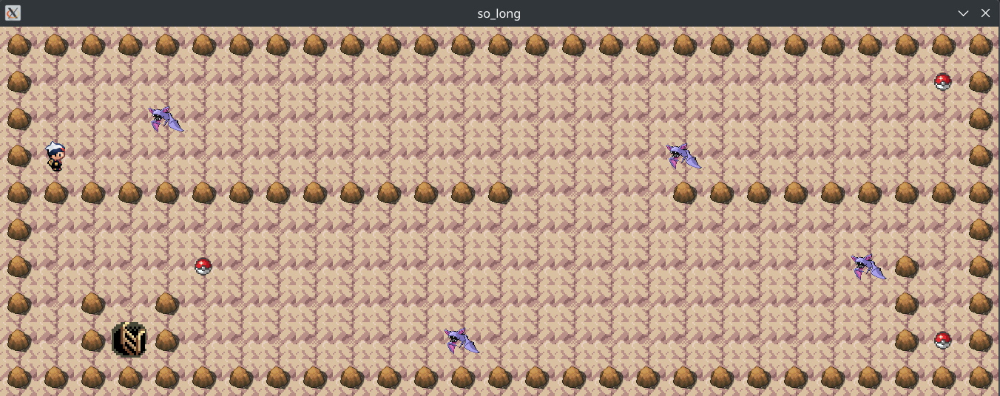

# So_long

## Description
So_long est un petit jeu 2D développé dans le cadre du cursus 42. Le joueur doit collecter tous les items et atteindre la sortie en évitant les obstacles.

## Captures d'écran

*Capture d'écran du jeu en action*

## Prérequis
Pour compiler et exécuter ce projet, vous aurez besoin des éléments suivants :

### Dépendances système
```bash
sudo apt-get update
sudo apt-get install gcc make xorg libxext-dev zlib1g-dev libbsd-dev libx11-dev
```

### MiniLibX (MLX)
La MiniLibX est une bibliothèque graphique simplifiée créée pour les étudiants de 42. Elle est incluse dans le projet.

Pour l'installer :
```bash
git clone https://github.com/42Paris/minilibx-linux.git mlx
cd mlx
make
```

## Structure du Projet
```
so_long/
├── include/
│   └── so_long.h    # Fichiers d'en-tête
├── src/
│   ├── main.c       # Point d'entrée du programme
│   ├── map.c        # Gestion de la carte
│   ├── player.c     # Gestion du joueur
│   └── utils.c      # Fonctions utilitaires
├── map/
│   └── map.ber      # Fichiers de carte
├── mlx/             # MiniLibX
└── Makefile         # Compilation du projet
```

## Installation

1. Clonez le dépôt :
```bash
git clone <votre-repo> so_long
cd so_long
```

2. Installez et compilez la MLX :
```bash
cd mlx
make
cd ..
```

3. Compilez le projet :
```bash
make
```

## Utilisation
Pour lancer le jeu :
```bash
./so_long maps/map.ber
```

## Format de la carte (.ber)
La carte doit respecter les règles suivantes :
- '1' pour les murs
- '0' pour les espaces vides
- 'C' pour les collectibles
- 'E' pour la sortie
- 'P' pour la position de départ du joueur
- 'I' pour les ennemis

Exemple de carte valide :
```
1111111111111
10010000000C1
1000011111001
1P0011E000001
1111111111111
```

Règles de validation :
- La carte doit être fermée/entourée de murs
- La carte doit être rectangulaire
- Il doit y avoir exactement :
  - Une position de départ (P)
  - Une sortie (E)
  - Au moins un collectible (C)
- La carte doit avoir un chemin valide

## Contrôles
- W ou ↑ : Déplacement vers le haut
- S ou ↓ : Déplacement vers le bas
- A ou ← : Déplacement vers la gauche
- D ou → : Déplacement vers la droite
- ESC : Quitter le jeu

## Fonctionnalités
- Gestion des mouvements fluides
- Compteur de mouvements
- Collecte d'items
- Gestion des collisions
- Vérification de la validité de la carte
- Gestion propre des erreurs
- Gestion de la mémoire

## Commandes Make
```bash
make        # Compile le projet
make clean  # Supprime les fichiers objets
make fclean # Supprime les fichiers objets et l'exécutable
make re     # Recompile le projet
```

## Gestion des Erreurs
Le programme gère les erreurs suivantes :
- Arguments invalides
- Fichier de carte invalide ou inaccessible
- Format de carte invalide
- Configuration de carte invalide
- Erreurs de mémoire
- Erreurs de la MLX

## Bonus Possibles
- Animation des sprites
- Ennemis qui se déplacent
- Affichage du nombre de mouvements dans la fenêtre


## License
Ce projet a été développé dans le cadre du cursus de l'école 42.